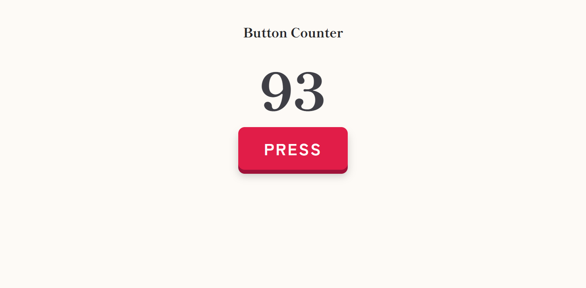

# Button Counter

A counter you click, with every click recorded in a database.

This is a project made by Group 5 in the Japanese IT Pathway Batch 1.

Live site: https://button-counter-group5.vercel.app



## Stack

| Layer     | Choice                         |
| --------- | ------------------------------ |
| Language  | TypeScript                     |
| Framework | SvelteKit 2 + Svelte 5 (runes) |
| Database  | Turso (libSQL)                 |
| Tests     | Vitest                         |
| CI        | GitHub Actions                 |
| Hosting   | Vercel                         |

## How it works

The page is rendered on the server. Every click is a form post, so the counter
also works with JavaScript turned off.

1. `src/routes/+page.server.ts` reads the newest row of the `click_events`
   table, which carries the current count.
2. Pressing the button posts to the `click` form action. The new count is
   computed inside the `INSERT` statement itself, so two people clicking at the
   same time can never store the same number twice.
3. `Counter.svelte` enhances the form with `use:enhance`. It shows the next
   number straight away and falls back to the server value once every in-flight
   click has answered.

| File                                        | Does                            |
| ------------------------------------------- | ------------------------------- |
| `src/lib/db.ts`                             | Turso client and queries        |
| `src/lib/server/db/schema.sql`              | The `click_events` table        |
| `src/routes/+page.server.ts`                | Load the page, handle the click |
| `src/lib/components/counter/Counter.svelte` | The button and the big number   |

## Getting started

You need Node.js 22 or higher. On Windows, turn on Developer Mode first, or
`npm run build` fails with `EPERM: symlink`.

```bash
git clone https://github.com/LaySopanha/Button-Counter.git
cd Button-Counter
npm install
```

### Set up the database

The app talks to Turso and refuses to start without credentials.

1. Install the CLI and log in:

   ```bash
   curl -sSfL https://tur.so/install.sh | bash   # Windows: run this inside WSL
   turso auth login
   ```

2. Create the database and the table:

   ```bash
   turso db create button-counter
   turso db shell button-counter < src/lib/server/db/schema.sql
   ```

3. Copy the credentials into `.env`:

   ```bash
   cp .env.example .env
   turso db show button-counter --url      # -> TURSO_DATABASE_URL
   turso db tokens create button-counter   # -> TURSO_AUTH_TOKEN
   ```

Never commit `.env`. If you are on the team, ask the leader for the shared
credentials instead of making your own database.

### Run it

```bash
npm run dev
```

Open http://localhost:5173.

## Scripts

| Command                | Does                            |
| ---------------------- | ------------------------------- |
| `npm run dev`          | Dev server with hot reload      |
| `npm run build`        | Production build                |
| `npm run preview`      | Serve the production build      |
| `npm run check`        | TypeScript + Svelte typecheck   |
| `npm run check:watch`  | Typecheck in watch mode         |
| `npm run test`         | Unit tests once                 |
| `npm run test:watch`   | Unit tests in watch mode        |
| `npm run format`       | Format all files with Prettier  |
| `npm run format:check` | Fail if anything is unformatted |

`npm run format:check`, `npm run check`, `npm run test` and `npm run build` are
the same four commands CI runs.

## Contributing

See [CONTRIBUTING.md](CONTRIBUTING.md). Short version: one issue, one branch,
one PR, CI green, one approval, squash merge.

## Team

| Member       | Area                        |
| ------------ | --------------------------- |
| @LaySopanha  | Lead, CI, deploy, reviews   |
| @zinhour10   | Database, Turso schema      |
| @virakbottch | Server routes, form actions |
| @Thaikarona  | Counter UI                  |
| @LYLEAB      | History UI                  |
| @Bemine5Cent | Tests, docs, QA             |
